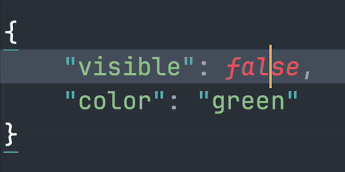

# Toggle Words

A Sublime Text plugin for toggling and cycling through words.



This plugin allows users to switch between predefined words or cycle through a list of words using keyboard shortcuts. For example,

- Toggle between "True" and "False".
- Cycle through "Red", "Blue", and "Green".

The word list is customizable via the settings file, allowing users to define their own words for toggling or cycling through. The default word list includes variations of "True" and "False".

## Features

1. No need to select a word in advance; the plugin automatically expands the cursor to the word.
2. Can operate on multiple words at the same time.
3. Customizable word list.

## Install

### 1. Package Control: Add Repository

```
https://github.com/aafulei/sublime-toggle-words
```

### 2. Package Control: Install Package

```
sublime-toggle-words
```

## How to Use

### 1. Define Key Bindings

This plugin does not come with default key bindings. Please define your own for the command `toggle_word`.

**Recommended Key Bindings**

```json
[
    { "keys": ["primary+k", "primary+\\"], "command": "toggle_word" }
]
```

| Command       | macOS                                                          | Windows / Linux                                                  |
| ------------- | -------------------------------------------------------------- | ---------------------------------------------------------------- |
| `toggle_word` | <kbd>cmd</kbd> + <kbd>K</kbd>,  <kbd>cmd</kbd> + <kbd>\\</kbd> | <kbd>ctrl</kbd> + <kbd>K</kbd>,  <kbd>ctrl</kbd> + <kbd>\\</kbd> |

*Note that the command `toggle_word` is also accessible via the Command Palette*

```
Toggle Word
```

*or the Main Menu*

```
Edit > Toggle Word
```

### 2. Define Word List

The list of words to toggle or cycle through can be customized in [`ToggleWords.sublime-settings`](./ToggleWords.sublime-settings).

```json
{
    "word_list": [
        ["TRUE", "FALSE"],
        ["True", "False"],
        ["true", "false"],
    ]
}
```

## Author

Aaron Fu Lei

## License

MIT
